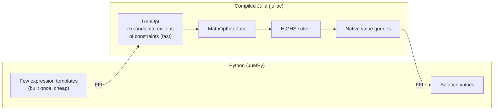

# JuMPy

[](https://nexor-optimization.github.io/JuMPy/)
[](https://github.com/NexOR-Optimization/JuMPy/actions/workflows/ci.yml)

A Python interface to [JuMP](https://github.com/jump-dev/JuMP.jl) and [GenOpt](https://github.com/blegat/GenOpt.jl), with native [MathOptInterface](https://github.com/jump-dev/MathOptInterface.jl) sets.

JuMPy lets you build optimization models from Python using native JuMP and GenOpt expressions behind thin Python handles. The Julia backend handles expression construction, constraint expansion, and solving.

## Why JuMPy?

Python modeling libraries like Pyomo and CVXPY construct models at Python speed. For large-scale problems with millions of constraints, model construction can take longer than solving. JuMPy eliminates this bottleneck.

The key idea: most large models are a small number of **constraint groups** — a parametric template repeated over a large index set. JuMPy builds one expression template per group in Python, then [GenOpt](https://github.com/blegat/GenOpt.jl) expands it into individual constraints in compiled Julia.


```mermaid
flowchart LR
    subgraph Python ["Python (JuMPy)"]
        templates["Few expression templates\n(built once, cheap)"]
        solution["Solution values"]
    end

    subgraph Julia ["Compiled Julia (juliac)"]
        genopt["GenOpt\nexpands into millions\nof constraints (fast)"]
        moi["MathOptInterface"]
        highs["HiGHS solver"]
        result["Native value queries"]

        genopt --> moi --> highs --> result
    end

    templates -- "FFI" --> genopt
    result -- "FFI" --> solution
```

The Python workload is proportional to the **number of groups**, not the number of constraints.

## Installation

This branch's native JuMP/GenOpt integration is a prototype. Building it or
using its JuliaCall interface currently requires a patched development checkout
of GenOpt; released GenOpt 0.2.1 is not sufficient. See the
[local development setup](julia/README.md#building).

```
pip install jumpy
```

The compiled HiGHS interface needs neither a Julia installation nor `juliacall`:
JuMPy ships a precompiled solver backend built with
[juliac](https://docs.julialang.org/en/v1/devdocs/juliac/).

Choose the interface when importing:

```python
import jumpy.highs as jp       # Compiled HiGHS
# Or: import jumpy.juliacall as jp  # Requires pip install 'jumpy[juliacall]'
```

Both expose the same modeling helpers and `Model()`, without a `backend`
argument. `jumpy.Model` is no longer exported. Use one interface per process;
the two Julia runtimes do not share objects.

## Quick start

```python
import jumpy.highs as jp

m = jp.Model()
x = m.variables(100, lower=0, name="x")

# A constraint group: 99 constraints from one template
i = m.iterator(range(99))
m.constraint_group(x[i] + x[i + 1] <= 10)

m.objective = jp.minimize(x[0] + x[1])
m.optimize()

print(m.value(x[0]))
```

## Constraint groups

Constraint groups are the core feature. Instead of building constraints one by one in Python, you write a single expression template with symbolic iterators.

`m.constraint_group(template)` is an alias for `m.constraint(template)`: GenOpt
recognizes iterator expressions and handles their expansion in Julia.

### Basic group

```python
i = m.iterator(range(1000000))
m.constraint_group(x[i] <= 10)
# One template in Python → 1,000,000 constraints in Julia
```

### Multi-dimensional

```python
i = m.iterator(range(100))
j = m.iterator(range(100))
m.constraint_group(x[100 * i + j] >= 0)
# 10,000 constraints from one template
```

### With data

```python
costs = m.parameter([...], name="costs")
demand = m.parameter([...], name="demand")

i = m.iterator(range(n))
m.constraint_group(costs[i] * x[i] >= demand[i])
```

### Nonlinear

```python
i = m.iterator(range(n))
m.constraint_group(jp.sin(x[i]) + jp.exp(x[i]) <= 1.0)
```

These functions construct nonlinear expressions; the chosen solver must support
them. HiGHS does not support the nonlinear constraints in this example.

### Individual constraints

For one-off constraints that don't need grouping:

```python
m.constraint(x[0] + x[1] == 5)
```

You can also pass an expression and an actual MOI set:

```python
m.constraint(x[0] + x[1], jp.MOI.LessThan(5.0))

z = m.variable()
m.constraint(z, jp.MOI.Integer())
```

The compiled interface exposes `LessThan`, `GreaterThan`, `EqualTo`, `ZeroOne`,
and `Integer`. These constructors create native Julia sets, not Python copies
of their definitions. JuliaCall's `jp.MOI` is the actual Julia module. Sets
must come from the same interface as the model. Comparisons, variable bounds,
and constraint groups use the same native sets internally.

Comparison syntax is shorthand: `m.constraint(z <= 1)` delegates to
`m.constraint(z, jp.MOI.LessThan(1.0))`. In either form, a bare variable remains
an MOI variable constraint (a bound or integrality restriction). Use an
expression such as `z + 0` when you want an affine row instead of a bound.

## API reference

### Model

| Method | Description |
|---|---|
| `m = jp.Model()` | Create a new model |
| `m.variables(n, lower=, upper=, name=, binary=, integer=)` | Add `n` variables, returns a `VariableVector` |
| `m.variable(lower=, upper=, name=, binary=, integer=)` | Add a single variable |
| `m.constraint_group(template)` | Add a constraint group (iterators are discovered from the template) |
| `m.constraint(con)` | Add a scalar constraint or iterator-based group |
| `m.constraint(func, jp.MOI.LessThan(rhs))` | Add a scalar function-in-set constraint |
| `m.objective = jp.minimize(expr)` | Set a minimization objective |
| `m.objective = jp.maximize(expr)` | Set a maximization objective |
| `m.iterator(range(n))` | An index set for constraint groups |
| `m.parameter(values, name=)` | A data vector, symbolically indexable |
| `m.optimize()` | Solve the model |
| `m.value(expr)` | Query the current native value of a variable or scalar expression |

### Expressions

Variables and iterators support standard arithmetic (`+`, `-`, `*`, `/`, `**`) and comparisons (`<=`, `>=`, `==`). Nonlinear functions are available as:

```python
jp.sin(x)   jp.cos(x)   jp.exp(x)
jp.log(x)   jp.sqrt(x)  jp.jp_abs(x)
```

Operations construct native JuMP expressions. JuMP determines whether an
expression is affine, quadratic, or nonlinear; Python does not classify it.
Integer literals remain integers, so `x ** 2` uses JuMP's quadratic arithmetic;
`x ** 2.0` follows its floating-exponent nonlinear arithmetic.
HiGHS supports linear constraints and convex quadratic objectives, such as
`m.objective = jp.minimize((x - 2) ** 2)`. Unsupported constraints and objectives
raise errors.

### Symbolic indexing

`VariableVector` and `Parameter` support both concrete and symbolic indexing:

```python
x[0]          # concrete: returns a Variable
x[i]          # symbolic: a getindex template node over the block
x[10*i + j]   # symbolic arithmetic on the index

costs[0]      # concrete: returns a float
costs[i]      # symbolic: a getindex template node over the data
```

Each variable array wraps its own native Julia array. Indices are local to that
array, with Python's zero-based and negative integer indexing. Adding another
array does not extend the first one's valid indices.

After solving, `m.value(x[0])` and `m.value(2 * x[0] + 1)` query JuMP directly.
There is no Python column-number mapping or copied solution cache.

## Architecture

JuMPy has two layers:

1. **Python package** (`jumpy`): Operator overloading calls native Julia operations eagerly. Python retains opaque expression references, without an expression tree or affine/nonlinear classification.

2. **Julia modeling layer**: JuMP constructs variables, expressions, constraints, and objectives. GenOpt builds iterator templates and expands them through its MOI bridge. The compiled interface exposes this layer through a small C ABI; JuliaCall invokes the same source directly.

Both backends use the same solver-independent Julia module,
[`JuMPyModel.jl`](julia/src/JuMPyModel.jl). JuliaCall loads this source from the
Python package; JuliaC compiles it into the backend image. Expressions are
native JuMP/GenOpt objects and sets are native MOI objects. This shares source
code, not live objects between separate Julia runtimes. The compiled build is
currently untrimmed.

```
src/jumpy/
├── highs.py              # Public compiled interface: Model() and native MOI sets
├── juliacall.py          # Public JuliaCall interface: Model() and Julia's MOI
├── expressions.py        # Native expression handles and operator overloading
├── bridge_juliacall.py   # Native modeling operations via juliacall
├── backend.py            # Compiled modeling operations via ctypes
├── julia/JuMPyModel.jl    # In wheels: shared source from julia/src/JuMPyModel.jl
└── model.py              # Model class: variables, groups, objective, solve
```

## How it maps to Julia

| Python | Julia |
|---|---|
| `m.iterator(range(n))` | A native GenOpt iterator |
| `x[i]` (symbolic) | GenOpt symbolic indexing of JuMP variables |
| `x[i] + x[i+1] <= 10` | A GenOpt expression template and native `MOI.LessThan` set |
| `m.constraint(...)` / `m.constraint_group(...)` | JuMP constraint construction; GenOpt's bridge expands iterator templates |
| `m.parameter([...])` | Data vector, `getindex` resolved during expansion |

## Development

```bash
# Run the pure-Python tests (uses uv: https://docs.astral.sh/uv/)
uv run --group tests pytest tests/test_expressions.py tests/test_backend.py tests/test_MILP.py

# Build the compiled backend (see julia/README.md), then:
uv run --group tests pytest tests/test_solve.py

# Or through juliacall (needs no compiled library):
JUMPY_BACKEND=juliacall uv run --group tests --extra juliacall pytest tests/test_solve.py

# Run example
uv run examples/basic.py
```

The compiled backend lives in [`julia/`](julia/): a Julia package
(`JuMPyHiGHS`) exposing native JuMP/GenOpt model construction with HiGHS through
C entry points, compiled with
[JuliaC](https://github.com/JuliaLang/JuliaC.jl). See
[`julia/README.md`](julia/README.md) for the C ABI and build instructions.

## Related projects

- [JuMP](https://github.com/jump-dev/JuMP.jl) — the Julia optimization modeling language
- [MathOptInterface](https://github.com/jump-dev/MathOptInterface.jl) — JuMP's solver abstraction layer
- [GenOpt](https://github.com/blegat/GenOpt.jl) — constraint group expansion
- [HiGHS](https://highs.dev/) — open-source LP/MIP solver

## License

MIT
