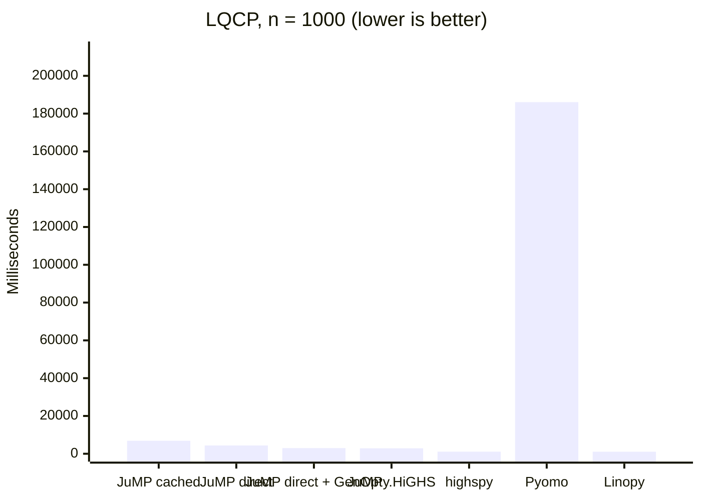

```mermaid
xychart-beta
    title "LQCP, n = 1000 (lower is better)"
    x-axis ["JuMP cached", "JuMP direct", "JuMP direct + GenOpt", "JuMPy.HiGHS", "highspy", "Pyomo", "Linopy"]
    y-axis "Milliseconds" 0 --> 213965.175
    bar [6870.732, 4397.412, 2982.370, 2873.812, 1120.763, 186056.674, 1078.349]
```
