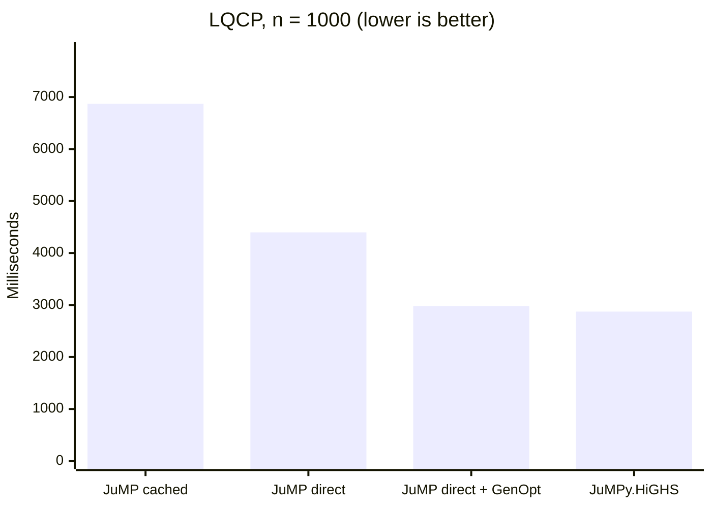

```mermaid
xychart-beta
    title "LQCP, n = 1000 (lower is better)"
    x-axis ["JuMP cached", "JuMP direct", "JuMP direct + GenOpt", "JuMPy.HiGHS"]
    y-axis "Milliseconds" 0 --> 7901.342
    bar [6870.732, 4397.412, 2982.370, 2873.812]
```
